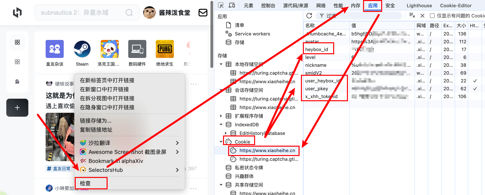

# 小黑盒 Bot

自动抓取小黑盒帖子并使用 LLM 生成评论回复的 Bot，支持自动发帖、每日新闻、角色切换等功能。

## 功能

- 自动抓取话题新帖并生成评论
- 自动回复 @消息 和评论回复
- 自动发帖（LLM 根据要求生成内容）
- 每日热点新闻汇总发帖
- 多角色切换（用户评论"转xx"触发、配置文件指定）
- 静默时段 / 频次限制 / 全局冷却
- 支持多话题抓取
- 支持图片识别

## 项目结构

```
heybox-bot/
├── bot.py                  # 主入口（循环编排 + 启动）
├── config.yaml             # 运行配置
├── requirements.txt        # Python 依赖
├── cookie/
│   └── cookie.json         # 浏览器导出的 cookie（可选，优先级高于 config.yaml）
├── src/
│   ├── scraper.py          # API 抓取 + @消息获取
│   ├── poster.py           # 发帖功能
│   ├── commenter.py        # 评论发送
│   ├── llm.py              # LLM 调用（OpenAI 兼容）
│   ├── sign.py             # 请求签名
│   ├── storage.py          # JSONL 数据存储
│   └── core/
│       ├── utils.py        # 全局状态 + 工具函数
│       ├── fetch.py        # 抓取逻辑
│       ├── post.py         # 自动发帖逻辑
│       ├── news.py         # 每日新闻逻辑
│       └── reply.py        # 回复逻辑（帖子/@ /评论）
├── prompts/
│   ├── base.md             # 基础 prompt
│   ├── post.md             # 发帖 prompt
│   ├── news.md             # 新闻 prompt
│   └── persona/            # 角色人设文件
│       ├── 奶龙.md
│       ├── 男娘.md
│       └── ...
└── data/                   # 运行时数据（JSONL）
    ├── posts.jsonl
    ├── at_messages.jsonl
    ├── reply_messages.jsonl
    ├── posts_sent.jsonl
    ├── hot_posts.jsonl
    ├── news_sent.jsonl
    └── role_switches.jsonl
```

## 安装

```bash
pip install -r requirements.txt
```

## 配置

复制示例配置文件并填写：

```bash
cp config.yaml.example config.yaml
```

编辑 `config.yaml`，主要配置项：

### Cookie

先登录网页端：https://www.xiaoheihe.cn/app/bbs/home

两种方式（二选一）：

1. 将浏览器导出的 cookie 放到 `cookie/cookie.json`，启动时自动读取（需要安装cookie editor插件，没有的话看第二条）
2. （推荐）在浏览器获取cookie：右键-检查-应用-cookie

   然后在 `config.yaml` 的 `cookie` 字段填写

   

### LLM

支持任何 OpenAI 兼容 API（DeepSeek、通义千问、Ollama 等）：

```yaml
llm:
  base_url: "https://api.example.com/v1"
  api_key: "sk-xxx"
  model: "gpt-4o-mini"
```

### Bot 运行参数

```yaml
bot:
  fetch_interval: 200        # 每轮抓取间隔（秒）
  reply_cooldown: 500        # 回复冷却（秒）
  max_age_hours: 24          # 只处理最近 N 小时的内容
  post_enabled: true         # 自动发帖开关
  post_interval_hours: 48    # 发帖间隔（小时）
  quiet_hours: ["23-7"]      # 静默时段
```

### 其他

```yaml
summary_enabled: true        # 长文省流功能开关
max_content_len: 150         # 触发省流的字数阈值
vision_imgs: 6               # 传给模型的图片数量（0=不看图）
```

## 使用

```bash
# 正常运行
python bot.py

# 试运行（不实际发送）
python bot.py --dry-run

# 指定配置文件
python bot.py --config my_config.yaml
```

### 手动发帖

```bash
# LLM 自由发挥
python bot.py --post

# 指定主题（LLM 根据主题生成）
python bot.py --post --subject "自我介绍"

# 指定主题 + 标签
python bot.py --post --subject "自我介绍" --hashtags "bot,日常"

# 直接指定标题和正文（跳过 LLM 生成）
python bot.py --post --title "帖子标题" --content "帖子正文内容"

# 试运行（只生成/预览，不发送）
python bot.py --post --subject "今天吃什么" --dry-run

# 指定话题ID（默认读 config 中的 bot.post_topic_id）
python bot.py --post --subject "推荐游戏" --topic "416158"
```

| 参数           | 说明                                             |
| -------------- | ------------------------------------------------ |
| `--post`     | 进入手动发帖模式，发完即退出                     |
| `--subject`  | 发帖主题，传给 LLM 作为创作方向                  |
| `--title`    | 直接指定标题（跳过 LLM）                         |
| `--content`  | 直接指定正文（跳过 LLM）                         |
| `--topic`    | 话题ID，默认用 config 中的 `bot.post_topic_id` |
| `--hashtags` | 标签，逗号分隔                                   |
| `--dry-run`  | 试运行，不实际发送                               |

## 角色切换

用户在评论中说"转xx"即可触发角色切换（需在 `role_whitelist` 白名单中）。角色人设文件放在 `prompts/persona/` 目录下。
